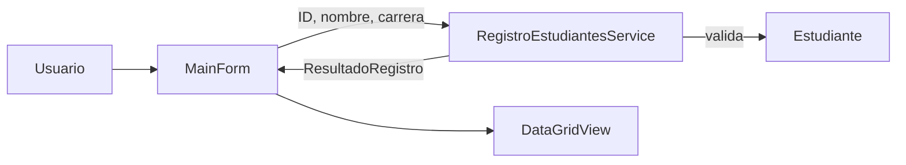

# Arquitectura

## Objetivo

Mantener una separación clara entre la interfaz gráfica, las reglas de validación y los datos, sin introducir complejidad innecesaria para el alcance del taller.

## Componentes

### 1. Presentación — `MainForm`

Responsable de:

- Capturar ID, nombre y carrera.
- Responder a los eventos de los botones.
- Mostrar mensajes de estado.
- Renderizar los registros en el `DataGridView`.

No contiene las reglas principales de registro.

### 2. Lógica — `RegistroEstudiantesService`

Responsable de:

- Verificar campos obligatorios.
- Convertir y validar el ID.
- Validar la longitud mínima del nombre.
- Evitar IDs duplicados.
- Mantener la colección de estudiantes durante la ejecución.

### 3. Dominio — `Estudiante` y `ResultadoRegistro`

`Estudiante` representa un registro válido.

`ResultadoRegistro` comunica a la interfaz si la operación fue exitosa, el mensaje correspondiente y, cuando aplica, el estudiante creado.

## Flujo

## Persistencia

No existe base de datos ni archivo permanente. La colección vive en memoria mientras la aplicación está abierta.

Esto es intencional: el desafío académico solicita creación y visualización de registros, no persistencia.

## Relación con Compiladores

La arquitectura de la aplicación es independiente del proceso de construcción. El proyecto C# se compila como ensamblado .NET y luego se publica para Windows, generando un host ejecutable `.exe` junto con las dependencias necesarias según la configuración seleccionada.
